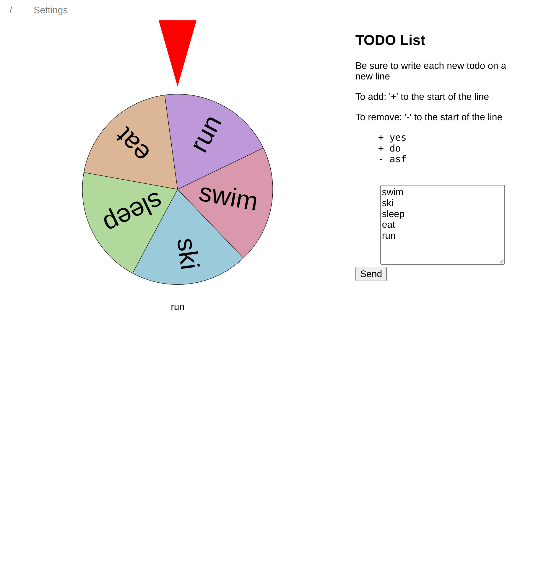

# neurod-task-spin
- Spinny wheel for todo task completion

## :hammer: How to Build

### Go Direct
```make 
# Using `make`
make

# Without `make`
go build

```

- **Note**: Building with or without `make` leads to a differently named binary:
  - with `make`: `spins`
  - without `make`: `neurod-task-spin`
  - they both do the same thing, just a name change

### Kubernetes


## :alembic: Usage


---

## :framed_picture: Screenshots / Images

### Screenshot Demo 



## :card_file_box: Directory Explanation

```s
# Use tree to get a nicer graphical implementation
.
├───dir1        ; explanation of dir1
└───dir2        ; ---
```

## :warning: Disclaimer

---

- [Advanced Github Usage](https://docs.github.com/en/get-started/writing-on-github/working-with-advanced-formatting/creating-diagrams)
- [Gitemojis for commiting](https://gitmoji.dev/)
- [Mermaid Syntax](https://mermaid-js.github.io/mermaid/#/)
